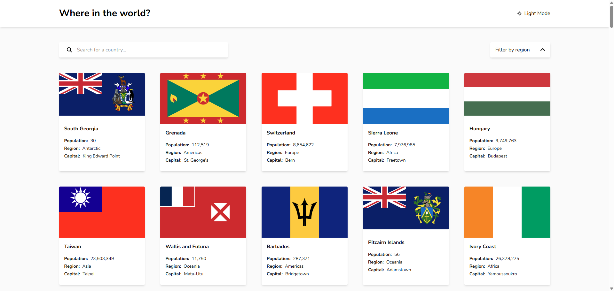

# Frontend Mentor - REST Countries API with color theme switcher solution

This is a solution to the [REST Countries API with color theme switcher challenge on Frontend Mentor](https://www.frontendmentor.io/challenges/rest-countries-api-with-color-theme-switcher-5cacc469fec04111f7b848ca). Frontend Mentor challenges help you improve your coding skills by building realistic projects.

## Table of contents

- [Overview](#overview)
  - [The challenge](#the-challenge)
  - [Screenshot](#screenshot)
  - [Links](#links)
- [My process](#my-process)
  - [Built with](#built-with)
  - [What I learned](#what-i-learned)
  - [Continued development](#continued-development)
  - [Useful resources](#useful-resources)
- [Author](#author)
- [Acknowledgments](#acknowledgments)

**Note: Delete this note and update the table of contents based on what sections you keep.**

## Overview

### The challenge

Users should be able to:

- See all countries from the API on the homepage
- Search for a country using an `input` field
- Filter countries by region
- Click on a country to see more detailed information on a separate page
- Click through to the border countries on the detail page
- Toggle the color scheme between light and dark mode _(optional)_

### Screenshot

### Links

- Solution URL: [https://github.com/jeangu2002/rest-countries-fe-mentor](https://github.com/jeangu2002/rest-countries-fe-mentor/)
- Live Site URL: [https://jeangu2002.github.io/rest-countries-fe-mentor](https://jeangu2002.github.io/rest-countries-fe-mentor/)

### Built with

- Semantic HTML5 markup
- [CSS custom properties](https://tympanus.net/codrops/css_reference/custom-properties/)
- [CSS flexbox](https://tympanus.net/codrops/css_reference/flexbox/)
- [CSS grid](https://tympanus.net/codrops/css_reference/grid/)
- [Tailwindcss 4.0](https://tailwindcss.com/)
- [Angular 19.2.1](https://angular.dev/)

### What I learned

Using signals in Angular, Changing the default route reuse strategy, integrating Tailwindcss with Angular and so on...

## Author

- Frontend Mentor - [@jeangu2002](https://www.frontendmentor.io/profile/jeangu2002)
- LinkedIn - [Jean Gustave NSABIYERA](https://lu.linkedin.com/in/jean-gustave-nsabiyera-b8018951)

## Useful resources

- [Route reuse strategy tutorial](https://blog.bitsrc.io/angular-route-reuse-strategy-c7939ebbf797) - helped me understand the route reuse strategy
